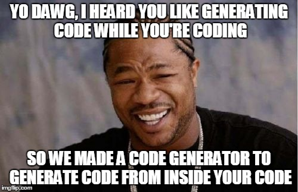

Snippety
=========

Snippety generates code inside your code from your code.

<p align="center">

</p>

###Wait......it does what?

Sometime end up with stuff like this:
``` python
def __init__(self, dataRow):
    self._name = dataRow.name
    self._age = dataRow.age
    self._height = dataRow.height
    self._weight = dataRow.weight
    # Evil duplication...
    print "created ", self.name
```
(_You could solve this particular example with **getattr()** and **setattr()** because it's Python, but this is just an example for illustration. Snippety works on any text files_)

With Snippety, you place a directive (in a comment) on the line you want to repeat:

``` python
def __init__(self, dataRow):
    self._name = dataRow.name         #sn_i [name] age height weight
    print "created ", self.name
```

Pass your file to Snippety, and it regenerates it with this:

``` python
def __init__(self, dataRow):
    self._name = dataRow.name         #sn_i [name] age height weight
    self._age = dataRow.age           #generated_code
    self._height = dataRow.height     #generated_code
    self._weight = dataRow.weight     #generated_code
    print "created ", self.name
```

Most IDEs load your buffer when the file is changed externally, so it refreshes like magic.

The **#generated_code** comments are for Snippety to track which lines it generated, so that if you change the directive or source line, it wipes and rebuilds those.

###Why is this special?

__A)__ Because you create the instructions to generate new lines of code **right from inside** your code. No need to open up an external tool. 

__B)__ It is dynamic, so if you change your directive and re-run Snippety, it updates your files, removing its own generated lines and replacing them with the new code.


__C)__ , multi-line blocks, and you can subclass and write your own.

You can also load lists (of say fields) from a config file.

You can run it as a tool from the terminal, or by importing into a Python script.

### Other goodies:
 * Snippety can be run as a tool, or imported into a python script.
 * There's an easy enumeration [0, 1, 2...] feature
 * There's intelligent capitalsation handling
 * These come from Snippety's **directives** and you can easily subclass and create your own.
 * Snippety regenerates the lines each time it is run, so you only need to change the original snippet.
 * You can have multi-line snippet, and even nested chunks within those!
 * You can direct the output to another file.
 * You can use collections defined in a config file instead of typing out each item in the directive
 * You can apply conditional statements (repeat for all elements if)


Here's an example using enumeration, and showing a directive with start (__sn_s__) and end (__sn_e__) directives as opposed to the inline (__sn_i__) shown above.

``` python
def __init__(self, dataRow):
    #sn_s [name, 0*1] age height weight
    self.name = dataRow[0]
    #sn_e
    self._age = dataRow[1]        #generated_code
    self._height = dataRow[2]     #generated_code
    self._weight = dataRow[3]     #generated_code
    print "created ", self.name
```

##Important information:

Snippety replaces the contents of the file you're actually working on, so make sure your IDE tells you when the underlying file contents have changed (most do). 

__THERFORE YOU MUST REMEMBER TO SAVE YOUR FILES BEFORE RUNNING SNIPPETY OVER THEM!__


Alternatively you can tell Snippety to output to a different location, leaving your source files untouched.

##How to use it

At the moment you need to call it from Python by importing snippety and exploring the classes and their docs.

As a simple example, create a file called __test.txt__ with this:

```
I'm a cat       #sn_i [cat] dog squirrel piggy
```

And a python file called **run_snippety.py** in the same directory:

``` python
from snippety import Snippety
sn = Snippety()
sn.process_file(argv[1])
```
From the command line, run:

**>>> run_snippety.py test.txt**

And __test.txt__ should become:

```
I'm a cat       #sn_i [cat] dog squirrel piggy
I'm a dog       #generated code
I'm a squirrel  #generated code
I'm a piggy     #generated code
```

There is more you can do, such as:
``` python
# process_dir catches all the files in a directory.
# can be passed include and exclude lists
sn.process_dir('.')
```
Unfortunately you'll have to look into the source code and unit tests to get an idea of what directives are working and available.

More documentation is coming :-)

##Tests

Snippety uses [pytest](http://pytest.org/latest/) for it's unit tests, and there's a fair amount of test that pass, but could do with more edge-case testing.

##Contribution guidelines

  * Stick to [Python Style Guide](http://legacy.python.org/dev/peps/pep-0008/)
  * Make sure the code is compatible with Python 2.7.

##Questions:

Email me at andyhasit@gmail.com.
